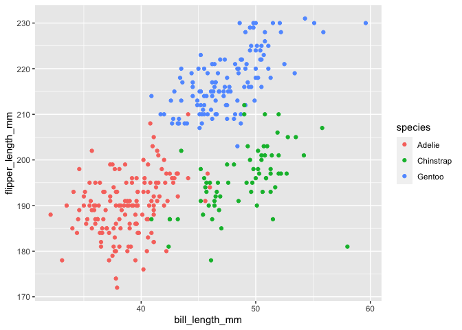

Homework 1
================
Mufeng Xu

This is my solution to HW1.

``` r
library(tidyverse)
```

    ## ── Attaching packages ─────────────────────────────── tidyverse 1.3.0 ──

    ## ✓ ggplot2 3.3.2     ✓ purrr   0.3.4
    ## ✓ tibble  3.0.3     ✓ dplyr   1.0.2
    ## ✓ tidyr   1.1.2     ✓ stringr 1.4.0
    ## ✓ readr   1.3.1     ✓ forcats 0.5.0

    ## ── Conflicts ────────────────────────────────── tidyverse_conflicts() ──
    ## x dplyr::filter() masks stats::filter()
    ## x dplyr::lag()    masks stats::lag()

## Problem 1

Create a data frame with the specified elements.

``` r
prob1_df = 
  tibble(
    samp = rnorm(10),
    samp_gt_0 = samp > 0,
    char_vec = c("a", "b", "c", "d", "e", "f", "g", "h", "i", "j"),
    factor_vec = factor(c("low", "low", "low", "mod", "mod", "mod", "mod", "high", "high", "high"))
  )
```

Take the mean of each variable in my data frame.

``` r
mean(pull(prob1_df, samp))
```

    ## [1] 0.4640147

``` r
mean(pull(prob1_df, samp_gt_0))
```

    ## [1] 0.6

``` r
mean(pull(prob1_df, char_vec))
```

    ## Warning in mean.default(pull(prob1_df, char_vec)): argument is not numeric or
    ## logical: returning NA

    ## [1] NA

``` r
mean(pull(prob1_df, factor_vec))
```

    ## Warning in mean.default(pull(prob1_df, factor_vec)): argument is not numeric or
    ## logical: returning NA

    ## [1] NA

I can take the mean of numbers and logical but not character and factor.

``` r
as.numeric(pull(prob1_df, samp))
```

    ##  [1]  1.1243782 -0.3046592  1.2121659  0.8281604  1.4895251 -0.1189451
    ##  [7]  1.5242474 -0.8891227 -0.6350096  0.4094069

``` r
as.numeric(pull(prob1_df, samp_gt_0))
```

    ##  [1] 1 0 1 1 1 0 1 0 0 1

``` r
as.numeric(pull(prob1_df, char_vec))
```

    ## Warning: NAs introduced by coercion

    ##  [1] NA NA NA NA NA NA NA NA NA NA

``` r
as.numeric(pull(prob1_df, factor_vec))
```

    ##  [1] 2 2 2 3 3 3 3 1 1 1

``` r
as.numeric(pull(prob1_df, samp_gt_0)) * pull(prob1_df, samp)
```

    ##  [1] 1.1243782 0.0000000 1.2121659 0.8281604 1.4895251 0.0000000 1.5242474
    ##  [8] 0.0000000 0.0000000 0.4094069

``` r
as.factor(pull(prob1_df, samp_gt_0)) * pull(prob1_df, samp)
```

    ## Warning in Ops.factor(as.factor(pull(prob1_df, samp_gt_0)), pull(prob1_df, : '*'
    ## not meaningful for factors

    ##  [1] NA NA NA NA NA NA NA NA NA NA

``` r
as.numeric(as.factor(pull(prob1_df, factor_vec))) * pull(prob1_df, samp)
```

    ##  [1]  2.2487564 -0.6093183  2.4243317  2.4844813  4.4685754 -0.3568354
    ##  [7]  4.5727423 -0.8891227 -0.6350096  0.4094069

## Problem 2

Load the dataset

``` r
data("penguins", package = "palmerpenguins")
```

Finding important variables, size of the dataset, the mean flipper
length

``` r
colnames(penguins)
```

    ## [1] "species"           "island"            "bill_length_mm"   
    ## [4] "bill_depth_mm"     "flipper_length_mm" "body_mass_g"      
    ## [7] "sex"               "year"

``` r
nrow(penguins)
```

    ## [1] 344

``` r
ncol(penguins)
```

    ## [1] 8

``` r
mean(penguins$flipper_length_mm, na.rm = TRUE)
```

    ## [1] 200.9152

the penguins dataset has 8 columns and 344 rows, and its important
variables’ names include: “species” ,“island”,“bill\_length\_mm”,
“bill\_depth\_mm”,“flipper\_length\_mm” “body\_mass\_g”, “sex”,
“year”. By skipping the NA, I found the mean flipper length is
200.9152 mm.

Load library(ggplot2)

``` r
library(ggplot2)
```

Make a scatterplot of flipper\_length\_mm over bill\_length\_mm, and
color coded by species

``` r
ggplot(penguins, aes(x=bill_length_mm, y=flipper_length_mm, na.rm = TRUE, color=species))+geom_point()
```

    ## Warning: Removed 2 rows containing missing values (geom_point).

<!-- -->

Save the plot as pdf

``` r
ggsave(file="penguins.pdf")
```

    ## Saving 7 x 5 in image

    ## Warning: Removed 2 rows containing missing values (geom_point).
